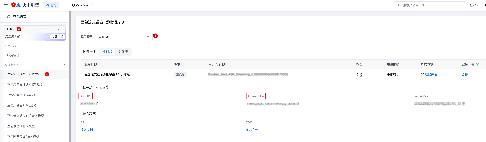

# 火山引擎凭证获取指南

本文档介绍如何获取火山引擎豆包流式语音识别服务的 API 凭证。



⚠️注意：要选择旧版控制台，还需要注意应用名称是自己创建的那个

## 所需凭证

WindVox 需要以下凭证才能正常工作：

| 凭证 | 说明 |
|------|------|
| `app_key` | 火山引擎控制台获取的 App ID |
| `access_key` | 火山引擎控制台获取的 Access Token |

## 获取步骤

1. 访问 [火山引擎语音控制台](https://console.volcengine.com/speech/app)
2. 点击"创建应用"
3. 填写应用名称，选择"语音识别"
4. 点击"创建"
5. 在应用详情页面，找到"App ID"和"Access Token"

## 配置凭证

获取凭证后，编辑 `~/.config/windvox/config.yaml`：

```yaml
volcengine:
  app_key: "你的 App ID"
  access_key: "你的 Access Token"
  resource_id: "volc.seedasr.sauc.duration"
```

## 参考链接

- [火山引擎语音控制台](https://console.volcengine.com/speech/app)
- [豆包流式语音识别服务文档](https://www.volcengine.com/docs/6561/97465)
